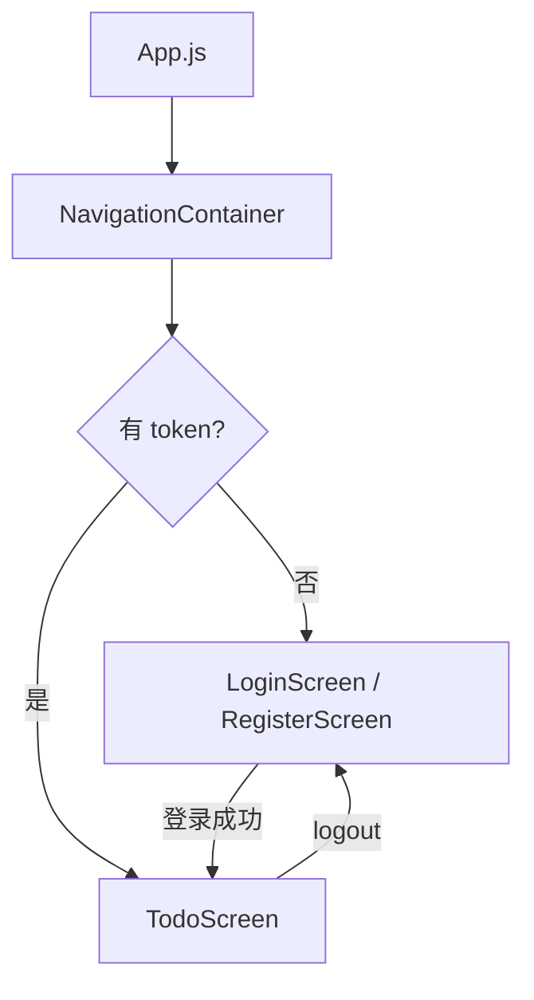

# 🗓️ 周末练习计划 (3.21-3.22)

> 目标：Node.js Koa 巩固 + React Native 入门
> 主题：Todo 全栈项目（后端 API + 移动端 App）

---

## 📅 Day 1 (3.21 周六) — Node.js Todo API

### 技术栈
- Koa2 + koa-router + koa-body + koa-jwt
- Sequelize + mysql2
- MySQL（本地环境）

### 项目结构
```
todo-api/
├── src/
│   ├── config/
│   │   └── db.js          # 数据库连接配置
│   ├── models/
│   │   ├── index.js       # Sequelize 初始化
│   │   ├── user.js        # User Model
│   │   └── todo.js        # Todo Model
│   ├── router/
│   │   ├── index.js       # 路由汇总
│   │   ├── user.js        # 用户路由
│   │   └── todo.js        # Todo 路由
│   ├── controller/
│   │   ├── user.js
│   │   └── todo.js
│   ├── service/
│   │   ├── user.js
│   │   └── todo.js
│   ├── middleware/
│   │   ├── auth.js        # JWT 鉴权中间件
│   │   └── error.js       # 统一错误处理
│   └── app.js             # 入口文件
├── uploads/               # 文件上传目录
├── .env
└── package.json
```

### Step-by-Step 任务清单

#### 第一步：初始化项目（15min）
- [ ] `mkdir todo-api && cd todo-api && npm init -y`
- [ ] 安装依赖：
  ```bash
  npm i koa koa-router koa-body koa-jwt jsonwebtoken koa-static
  npm i sequelize mysql2 dotenv bcryptjs
  npm i nodemon -D
  ```
- [ ] 创建 `.env`：
  ```
  DB_HOST=localhost
  DB_USER=root
  DB_PASS=你的密码
  DB_NAME=todo_db
  JWT_SECRET=your_secret_key
  PORT=3000
  ```
- [ ] 配置 `package.json` scripts：`"dev": "nodemon src/app.js"`

#### 第二步：数据库 & Model（30min）
- [ ] MySQL 创建数据库：`CREATE DATABASE todo_db;`
- [ ] `src/config/db.js` — Sequelize 连接配置
- [ ] `src/models/user.js` — 字段：id, username, password, avatar
- [ ] `src/models/todo.js` — 字段：id, title, done, userId（外键）
- [ ] `src/models/index.js` — 关联关系：User hasMany Todo
- [ ] `app.js` 启动时 `sequelize.sync()` 自动建表

#### 第三步：用户模块（45min）
- [ ] `POST /api/register` — 注册（bcrypt 加密密码）
- [ ] `POST /api/login` — 登录（验证密码，返回 JWT token）
- [ ] `POST /api/upload` — 上传头像（koa-body 处理文件）
- [ ] 测试：Postman / curl 验证注册登录流程

#### 第四步：JWT 鉴权中间件（20min）
- [ ] `src/middleware/auth.js` — 解析 Authorization header
- [ ] 路由中引入，保护 Todo 接口
- [ ] 测试：不带 token 返回 401，带 token 正常访问

#### 第五步：Todo CRUD（45min）
- [ ] `GET  /api/todos` — 获取当前用户的所有 Todo
- [ ] `POST /api/todos` — 新增 Todo
- [ ] `PUT  /api/todos/:id` — 修改（标题 / 完成状态）
- [ ] `DELETE /api/todos/:id` — 删除
- [ ] 注意：只能操作自己的 Todo（service 层加 userId 过滤）

#### 第六步：统一错误处理（15min）
- [ ] `src/middleware/error.js` — 捕获所有未处理异常
- [ ] 统一返回格式：`{ code, message, data }`
- [ ] 测试：故意触发错误，验证格式正确

#### 完成标准 ✅
- [ ] 注册/登录/上传头像正常
- [ ] JWT 鉴权生效
- [ ] Todo 增删改查正常
- [ ] 分层结构清晰（router → controller → service → model）

---

## 📅 Day 2 (3.22 周日) — React Native Todo App

### 技术栈
- Expo (managed workflow)
- React Navigation（页面导航）
- Axios（网络请求）
- AsyncStorage（本地存储 token）
- React Context（全局状态）

### 项目结构
```
todo-app/
├── src/
│   ├── screens/
│   │   ├── LoginScreen.js
│   │   ├── RegisterScreen.js
│   │   └── TodoScreen.js
│   ├── components/
│   │   ├── TodoItem.js
│   │   └── AddTodoModal.js
│   ├── context/
│   │   └── AuthContext.js     # 全局登录状态
│   ├── api/
│   │   └── index.js           # axios 封装
│   └── navigation/
│       └── index.js           # 路由配置
├── App.js
└── package.json
```

### Step-by-Step 任务清单

#### 第一步：装环境（30-60min）
- [ ] 安装 Node.js（已有）
- [ ] `npm install -g expo-cli`
- [ ] 手机安装 **Expo Go** App（App Store / 应用宝）
- [ ] `npx create-expo-app todo-app --template blank`
- [ ] `cd todo-app && npx expo start`
- [ ] 手机扫码，看到默认页面 → 环境 OK ✅

#### 第二步：安装依赖 & 配置导航（30min）
- [ ] 安装依赖：
  ```bash
  npx expo install @react-navigation/native @react-navigation/native-stack
  npx expo install react-native-screens react-native-safe-area-context
  npx expo install @react-native-async-storage/async-storage
  npm install axios
  ```
- [ ] `src/navigation/index.js` — Stack Navigator 配置
  - 未登录：LoginScreen / RegisterScreen
  - 已登录：TodoScreen
- [ ] `App.js` 引入导航容器

#### 第三步：AuthContext（20min）
- [ ] `src/context/AuthContext.js`
  - 存储 token、user 信息
  - 提供 login / logout 方法（token 存 AsyncStorage）
  - 根据 token 决定导航到登录页还是 Todo 页

#### 第四步：API 封装（20min）
- [ ] `src/api/index.js` — axios 实例
  - baseURL 指向周六的 Koa API（本地 IP:3000）
  - 请求拦截器：自动带上 Authorization header
  - 响应拦截器：统一错误处理

#### 第五步：登录 / 注册页（45min）
- [ ] `LoginScreen.js`
  - TextInput（用户名/密码）+ Button
  - 调用 API，成功后存 token，跳转 TodoScreen
- [ ] `RegisterScreen.js`
  - 同上，注册成功跳登录页
- [ ] 样式：StyleSheet，居中布局，简洁即可

#### 第六步：Todo 页面（60min）
- [ ] `TodoScreen.js`
  - FlatList 展示 Todo 列表
  - 下拉刷新（refreshing）
  - 右上角 logout 按钮
- [ ] `TodoItem.js`
  - 显示标题 + 完成状态（Checkbox）
  - 点击完成 → 调用 PUT 接口
  - 左滑删除 / 长按删除 → 调用 DELETE 接口
- [ ] `AddTodoModal.js`
  - Modal 弹窗输入标题
  - 确认后调用 POST 接口，刷新列表

#### 完成标准 ✅
- [ ] 手机上跑起来
- [ ] 登录/注册正常，token 持久化
- [ ] Todo 增删改查正常，和 Koa API 联通
- [ ] 对 RN 的组件/导航/样式/请求有整体感觉

---

## 📝 知识点速记（练完补充）

### React Native 和 React Web 的主要区别

| | React Web | React Native |
|---|---|---|
| 基础组件 | div / span / input | View / Text / TextInput |
| 样式 | CSS 文件 / className | StyleSheet.create（JS 对象）|
| 布局 | 正常盒模型 | 默认 Flexbox，且默认 flexDirection: column |
| 导航 | React Router | React Navigation |
| 列表 | ul/li / map | FlatList / SectionList |
| 网络 | fetch / axios | 同（但需注意 Android 明文 HTTP 限制）|



---

> 💡 Tips：
> - RN 调试：摇手机 → 开发者菜单 → Element Inspector
> - Android 本地请求需用真实 IP（不能用 localhost），如 `192.168.x.x:3000`
> - Expo Go 热更新很快，改完代码秒刷新
