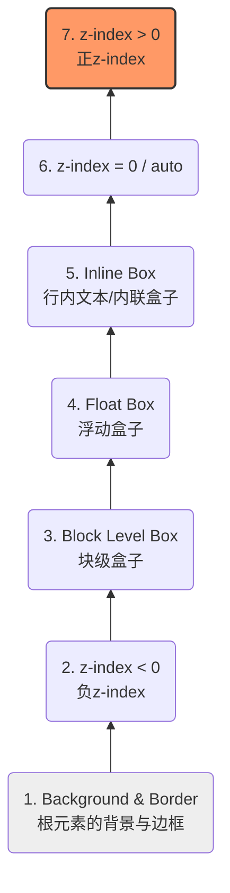
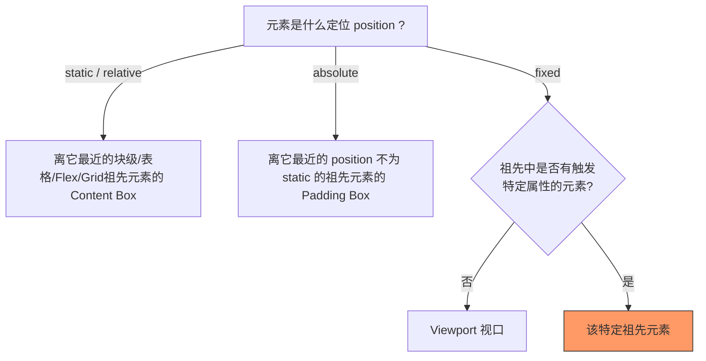

# 深入理解浏览器渲染机制与 CSS 底层模型

为了加深技术深度，本章将跳出“如何使用 CSS 属性”的范畴，从**浏览器内核（Blink/Webkit）的渲染管线**、**Z轴空间模型**和**布局上下文**的角度来深度剖析 CSS 的底层机制。

## 一、 浏览器关键渲染路径（Critical Rendering Path）

要理解重绘（Repaint）与回流（Reflow），首先必须搞懂浏览器的渲染流水线。

### 1.1 核心深研：图层合成（Composite Layers）与硬件加速

很多面试题会问：“为什么 `transform` 和 `opacity` 的性能更好？” 答案在于**复合（Composite）**阶段。

普通文档流元素都绘制在同一个默认图层（Main Layer）上。当我们修改普通属性（如 `width`）时，会触发：
`Layout -> Paint -> Composite`，整个图层都需要重新绘制，消耗巨大 CPU 资源。

但如果我们通过特定属性将元素**提升为独立的复合层（Compositing Layer）**，它将交由 **GPU** 处理，更新时**直接跳过 Layout 和 Paint**，只执行 Composite（图层位移/透明度计算）。

**触发独立复合层（硬件加速）的常见机制：**

- `transform` (3D 变换如 `translate3d`, `translateZ`)
- `will-change: transform | opacity` (最推荐的现代做法)
- `<video>`, `<iframe>`, `<canvas>`, `webgl` 等元素
- `filter`
- `z-index` 大于某个独立图层且发生重叠的元素（隐式图层提升，容易引发**层爆炸**内存泄漏）

---

## 二、 三维空间：层叠上下文（Stacking Context）与层叠顺序

在 CSS 中，HTML 并不只是二维平面的，它具有 Z 轴。**层叠上下文**是 HTML 元素的三维概念。

### 2.1 著名的“七阶层叠顺序”（Stacking Order）

在一个层叠上下文中，元素的渲染顺序严格遵循以下图示规则（从底到顶）：

**深度思考：** 为什么浮动元素（Float）会盖住普通块级元素（Block），但盖不住文字（Inline）？

> **答：** 因为浮动的最初设计动机就是为了实现**“文字环绕图片”**。所以在层叠顺序中，Inline（文字）的层级天然高于 Float。

### 2.2 如何触发层叠上下文？（不仅仅是 z-index）

如果元素 A 的 `z-index: 9999`，却被元素 B 的 `z-index: 1` 盖住了，大概率是因为它们不在同一个“层叠上下文”中（拼爹失败）。

**现代 Web 中触发层叠上下文的条件（背诵重点）：**

1. 根元素 `<html>` (默认层叠上下文)
2. `position: absolute / relative` 且 `z-index` **不为 auto**。
3. `position: fixed / sticky` (即使 z-index 为 auto)。
4. `display: flex / grid` 的**直接子元素**，且 `z-index` **不为 auto**。
5. `opacity` 小于 1。
6. `transform`, `filter`, `backdrop-filter`, `clip-path` 不为 none。
7. `will-change` 设置为上述任意属性。
8. `isolation: isolate`（现代专门用来创建层叠上下文的安全属性）。

---

## 三、 包含块（Containing Block）：绝对定位的真正基准

很多开发者以为 `position: absolute` 是相对于离它最近的 `position: relative/absolute` 定位，`position: fixed` 是相对于视口（Viewport）定位。这其实是**不准确**的。

**深度原则：定位元素的大小和位置，取决于它的“包含块”。**

### 3.1 包含块的判定规则树

### 3.2 致命陷阱：Transform 对 Fixed 定位的降维打击

这是大厂极其高频的深度面试题/Bug场景：**为什么 `position: fixed` 的弹窗跟着页面滚走了？**

**底层机制**：当一个元素的祖先节点具备以下任意属性时，这个祖先节点就会成为 `fixed` 和 `absolute` 的包含块，**视口定位失效**：

- `transform` 不为 `none`
- `perspective` 不为 `none`
- `filter` / `backdrop-filter` 不为 `none`
- `will-change: transform/filter`

**修复方案：** 弹窗类组件（Modal/Dialog）应使用 React Portal / Vue Teleport 直接挂载到 `<body>` 下，或者使用原生 `<dialog>` 标签，从 DOM 结构上脱离 `transform` 祖先。

---

## 四、 BFC（Block Formatting Context）的本质

BFC 经常被当做魔法来清除浮动，但从规范角度看，**BFC 的本质是一个“独立隔离的渲染区域”**。

**BFC 的三个核心规律机制（内部自洽，外部隔离）：**

1. **内部 Box 垂直排列**，且相邻 Box 的垂直 margin 会发生重叠（**考点**：要解决 margin 重叠，就把它们放进不同的 BFC）。
2. **BFC 区域不会与 Float 盒子重叠**（**考点**：利用此特性实现左侧浮动图片，右侧文字自适应的经典两栏布局）。
3. **计算 BFC 高度时，浮动元素也参与计算**（**考点**：利用此特性清除浮动，解决父元素高度塌陷）。
