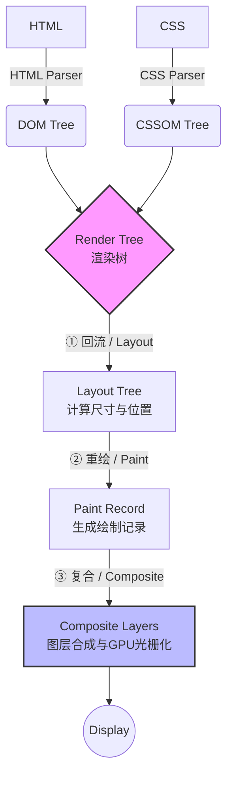
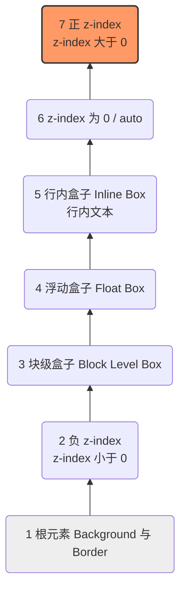
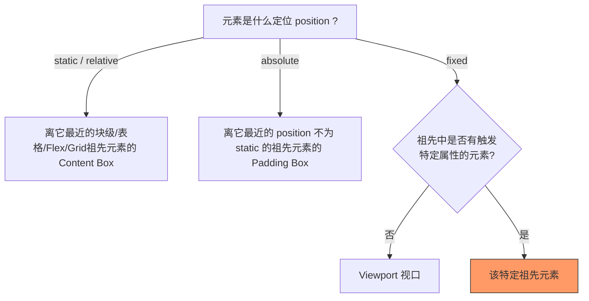

# 深入理解浏览器渲染机制与 CSS 底层模型

为了加深技术深度，本章将跳出“如何使用 CSS 属性”的范畴，从**浏览器内核（Blink/Webkit）的渲染管线**、**Z轴空间模型**和**布局上下文**的角度来深度剖析 CSS 的底层机制。

## 一、 浏览器关键渲染路径（Critical Rendering Path）

要理解重绘（Repaint）与回流（Reflow），首先必须搞懂浏览器的渲染流水线。



上图把管线压成了 3 步（Layout → Paint → Composite），方便快速记忆。但真实管线要细得多——它横跨**主线程**（1–6 步：决定“画什么、怎么画、归哪层”）和**合成线程 / GPU**（7–8 步：真正“画出像素、拼上屏”）。下面把每一步完整走一遍，并把关键坑点直接融进对应步骤。

#### 第 1 步：解析 HTML → DOM 树

浏览器边下载边解析 HTML 字节流，构建 **DOM 树**。三条阻塞规则要记牢：无 `async`/`defer` 的 `<script>` 会**阻塞 HTML 解析**（浏览器必须停下来先执行脚本，因为脚本可能 `document.write`）；脚本还可能读取样式，所以它又会被尚未构建完的 **CSSOM 阻塞**。

#### 第 2 步：解析 CSS → CSSOM 树

CSS 与 HTML **并行解析**，构建 **CSSOM 树**。CSS 是**渲染阻塞**资源——CSSOM 没构建完就不会进入下一步合并，页面会一直白屏，这也是「CSS 放 `<head>`、尽早加载」的根本原因。

#### 第 3 步：DOM + CSSOM → 渲染树（Render Tree）

把 DOM 与 CSSOM 合并，**只保留可见节点**：`display: none` 连盒子都不生成、直接不进树；`visibility: hidden` 会进树（占位但不可见）；`<head>`、`<script>`、`<meta>` 等非视觉节点不进。树里每个节点叫**渲染对象（LayoutObject）**，携带“要画什么”的样式信息，但**还没有任何几何数值**。

#### 第 4 步：Layout（布局 / 回流）——算“几何”

遍历渲染树，算出每个盒子的**尺寸 + 布局坐标**，得到 Layout 树。首次执行叫 **Layout**；页面已渲染后因几何变动（改 `width`、`top`、插入节点、改字体等）再次触发，叫 **Reflow（重排 / 回流）**。这里算的是**布局坐标**（相对文档 / 包含块，稳定不变）；真正的**屏幕像素坐标 = 布局坐标 − 滚动偏移 + 合成层 transform**，后两项要等到合成阶段才叠加，所以滚动和 `transform` 位移都不必重新 Layout。

#### 第 5 步：Paint（绘制 / 重绘）——只写“指令”，不产生像素

**这是最容易被误解的一步**：Paint 并不画出任何像素，它生成的是一串**绘制指令清单（display list）**，例如 `drawRect(...)`、`drawText(...)`——本质是“怎么画的菜谱”。位置来自第 4 步 Layout，内容（颜色 / 边框 / 文字 / 阴影 / 层叠顺序）由 Paint 决定。首次叫 Paint；后续因**不影响布局**的样式（如 `color`、`background`）变化再次触发，叫 **Repaint（重绘）**。

#### 第 6 步：Layer（分层）——把指令按图层归类

栅格化是**按层进行**的，所以在栅格化之前必须先决定“哪些绘制指令属于哪一层”。分层就负责把第 5 步产出的指令清单按图层归类，让每层能单独画、单独复用。`transform`、`opacity`、`will-change`、`<video>`/`<canvas>`、`filter`、发生重叠的高 `z-index` 元素等都可能被提升为**独立合成层**（隐式提升过多会引发「层爆炸」内存问题）。

> 精确性说明：Chrome 现代渲染架构（RenderingNG）里“分层决策”与 Paint 结合得很紧，把“分层”当成独立大阶段是一种**教学简化**；理解因果顺序时，记住“必须先分层，栅格化才知道把哪些指令画进哪张位图”即可。

#### 第 7 步：Raster（栅格化 / 光栅化）——真正产出像素

这一步才把绘制指令**执行成真实像素**。“栅格化 = 光栅化”，是同一个词。它把第 5 步的指令清单跑一遍，生成**位图（bitmap）**——一张二维像素网格，每个像素存一个 RGBA 值（红、绿、蓝、透明度各 0–255）。例如一个 204×104 的图层，栅格化后就是 204×104 个像素格子、每格一个 RGBA。每层各自独立栅格化成一张位图；大图层还会切成 **tile（瓦片）**，优先栅格化视口附近的，屏幕外的按需再做。这步计算量大，现代浏览器多交给 **GPU 加速**。

#### 第 8 步：Composite（合成）——拼合上屏

**合成线程**（独立于主线程）拿各层现成的位图，按位置、层叠顺序、`transform`、`opacity` 拼成最终画面，交 GPU 显示。整个过程**不需要主线程参与**——这正是流畅动画的关键：即便主线程被 JS 卡住，纯合成的动画依然不掉帧。

> 一句话串起来：**渲染对象（画什么）→ Layout 树（画在哪、多大）→ 绘制指令（怎么画的菜谱）→ 栅格化（真的下厨、产出像素位图）→ 合成（拼图上屏）**。

### 1.1 核心深研：图层合成（Composite Layers）与硬件加速

很多面试题会问：“为什么 `transform` 和 `opacity` 的性能更好？” 答案在于**复合（Composite）**阶段。

普通文档流元素都绘制在同一个默认图层（Main Layer）上。当我们修改普通属性（如 `width`）时，会触发：
`Layout -> Paint -> Composite`，整个图层都需要重新绘制，消耗巨大 CPU 资源。

但如果我们通过特定属性将元素**提升为独立的复合层（Compositing Layer）**，它将交由 **GPU** 处理，更新时**直接跳过 Layout 和 Paint**，只执行 Composite（图层位移/透明度计算）。

**触发独立复合层（硬件加速）的常见机制：**

- `transform` (3D 变换如 `translate3d`, `translateZ`)
- `will-change: transform | opacity` (最推荐的现代做法)
- `<video>`, `<iframe>`, `<canvas>`, `webgl` 等元素
- `filter`
- `z-index` 大于某个独立图层且发生重叠的元素（隐式图层提升，容易引发**层爆炸**内存泄漏）

### 1.2 完整渲染管线（8 步）：主线程 vs 合成线程

上面（§一 简化图正下方）已按第 1–8 步逐步讲透。这里给一张紧凑的 ASCII 总览图，方便面试速记——每步的细节和坑点回看上文详解即可：

```text
主线程 ─────────────────────────────────────────────
1. 解析 HTML  → DOM 树
2. 解析 CSS   → CSSOM 树        （1、2 并行；CSS 阻塞渲染，JS 阻塞解析）
3. DOM + CSSOM → 渲染树（Render Tree，只含可见节点 + 样式）
4. Layout（布局/回流）  → 算出每个盒子的几何：尺寸 + 布局坐标
5. Paint（绘制/重绘）   → 生成“绘制指令清单”（display list），此时无像素
6. Layer（分层）        → 把绘制指令按图层归类
合成线程 / GPU ──────────────────────────────────────
7. Raster（栅格化/光栅化）→ 每层各自执行指令 → 每层一张像素位图（bitmap）
8. Composite（合成）     → 按位置/层叠/transform/opacity 拼合各层位图 → 上屏
```

### 1.3 名词澄清：Paint 写菜谱，Raster 才下厨

这几个词最容易混，用一个 `.card` 例子串起来：

- **渲染对象**：`.card` 对应的节点，记着“块级盒、背景天蓝、深蓝边框、白字 Hello”——**要画什么**。
- **Layout 树**：排布后 `.card` 多出具体数值“位置 (8,8)、尺寸 204×104”——**画在哪、多大**。
- **绘制指令（display list）**：Paint 产出的命令脚本，**还没有像素**：

```text
drawRect(8, 8, 204, 104, navy)      // 边框底
drawRect(10, 10, 200, 100, skyblue) // 背景
drawText("Hello", ..., white)       // 文字
```

- **栅格化（= 光栅化）**：执行上面的指令，生成 204×104 个像素格子、每格一个 RGBA 值的**位图**。位图就是字面意义上一格格的具体像素点。

一句话：**渲染对象（画什么）→ Layout 树（画在哪、多大）→ 绘制指令（怎么画的菜谱）→ 栅格化（真的下厨、产出像素位图）→ 合成（拼图上屏）**。

### 1.4 三条“改动成本”规律与动画黄金法则

| 改动的属性                               | 触发的阶段                          | 成本           |
| ---------------------------------------- | ----------------------------------- | -------------- |
| `width`/`height`/`top`/`margin` 等几何   | Layout → Paint → Raster → Composite | 最贵（重排）   |
| `color`/`background`/`box-shadow` 等外观 | Paint → Raster → Composite          | 中等（重绘）   |
| `transform`/`opacity`（且已是独立层）    | 只 Composite                        | 最便宜（合成） |

**Reflow 与 Repaint 的关系**：Reflow 一定引起 Repaint（几何变了必重画），但 Repaint 不一定引起 Reflow（只改颜色位置没变）。

**为什么 `transform`/`opacity` 只走合成**：它们的图层位图**内容没变**，改的只是“这张现成位图怎么贴上去”——变换矩阵和透明度系数。合成线程换个参数重贴即可，**跳过 Layout、Paint、Raster**；且合成在独立线程，即便主线程被 JS 卡住动画也不掉帧。

**关键区分：能提升图层 ≠ 改动免重绘。** 真正“改动零重绘、只走合成”的只有 `transform` 和 `opacity`；`filter` 改参数仍要重新栅格化，`will-change` 只是“提前占层”的提示，`<video>` 是每帧都在重栅格化。所以高性能动画黄金法则：**只用 `transform` + `opacity` 驱动动画**。

> 自测方法：Chrome DevTools → Rendering 面板 → **Paint flashing**，做动画时元素区域不闪绿 = 纯合成没重绘，闪绿 = 在重绘。拿 `transform` 动画和 `left` 动画各试一次，对比很直观。

### 1.5 面试口述版（先骨架，再结论，留钩子）

**30 秒骨架**：浏览器渲染分两大块——主线程负责“算什么、怎么画”，合成线程和 GPU 负责“真正画出来、拼上屏”。主线程先把 HTML 解析成 DOM、CSS 解析成 CSSOM，合并成渲染树；然后 Layout 算大小和位置，Paint 生成“怎么画”的绘制指令，再按图层把指令分组；之后交给合成线程，栅格化把指令画成像素位图，最后合成把各图层拼起来上屏。

**被追问时的三个关键结论**：

1. 改几何触发 Reflow 重排，重排一定连带 Repaint 重绘；只改颜色只重绘不重排，所以重排更贵。
2. Paint 只生成绘制指令、不产出像素，真正产出像素是后面的栅格化——位置来自 Layout、内容来自 Paint、像素来自 Raster。
3. `transform`/`opacity` 性能好，是因为只走合成、跳过 Layout/Paint/栅格化，且在独立线程不被 JS 卡住——做动画优先用这两个。

**交流技巧**：别背 8 个英文单词，讲成三段故事“解析建树 → 算布局画指令 → 栅格化合成上屏”，中间穿插结论；讲完流程顺势抛出“所以动画要用 transform/opacity”比等着被问更主动。

---

## 二、 三维空间：层叠上下文（Stacking Context）与层叠顺序

在 CSS 中，HTML 并不只是二维平面的，它具有 Z 轴。**层叠上下文**是 HTML 元素的三维概念。

### 2.1 著名的“七阶层叠顺序”（Stacking Order）

在一个层叠上下文中，元素的渲染顺序严格遵循以下图示规则（从底到顶）：



**深度思考：** 为什么浮动元素（Float）会盖住普通块级元素（Block），但盖不住文字（Inline）？

> **答：** 因为浮动的最初设计动机就是为了实现**“文字环绕图片”**。所以在层叠顺序中，Inline（文字）的层级天然高于 Float。

### 2.2 如何触发层叠上下文？（不仅仅是 z-index）

如果元素 A 的 `z-index: 9999`，却被元素 B 的 `z-index: 1` 盖住了，大概率是因为它们不在同一个“层叠上下文”中（拼爹失败）。

**现代 Web 中触发层叠上下文的条件（背诵重点）：**

1. 根元素 `<html>` (默认层叠上下文)
2. `position: absolute / relative` 且 `z-index` **不为 auto**。
3. `position: fixed / sticky` (即使 z-index 为 auto)。
4. `display: flex / grid` 的**直接子元素**，且 `z-index` **不为 auto**。
5. `opacity` 小于 1。
6. `transform`, `filter`, `backdrop-filter`, `clip-path` 不为 none。
7. `will-change` 设置为上述任意属性。
8. `isolation: isolate`（现代专门用来创建层叠上下文的安全属性）。

---

## 三、 包含块（Containing Block）：绝对定位的真正基准

很多开发者以为 `position: absolute` 是相对于离它最近的 `position: relative/absolute` 定位，`position: fixed` 是相对于视口（Viewport）定位。这其实是**不准确**的。

**深度原则：定位元素的大小和位置，取决于它的“包含块”。**

### 3.1 包含块的判定规则树



### 3.2 致命陷阱：Transform 对 Fixed 定位的降维打击

这是大厂极其高频的深度面试题/Bug场景：**为什么 `position: fixed` 的弹窗跟着页面滚走了？**

**底层机制**：当一个元素的祖先节点具备以下任意属性时，这个祖先节点就会成为 `fixed` 和 `absolute` 的包含块，**视口定位失效**：

- `transform` 不为 `none`
- `perspective` 不为 `none`
- `filter` / `backdrop-filter` 不为 `none`
- `will-change: transform / perspective / filter`
- `contain: layout / paint / strict`（或 `content`，因其含 paint）

**修复方案：** 弹窗类组件（Modal/Dialog）应使用 React Portal / Vue Teleport 直接挂载到 `<body>` 下，或者使用原生 `<dialog>` 标签，从 DOM 结构上脱离 `transform` 祖先。

---

## 四、 BFC（Block Formatting Context）的本质

BFC 经常被当做魔法来清除浮动，但从规范角度看，**BFC 的本质是一个“独立隔离的渲染区域”**。

**BFC 的三个核心规律机制（内部自洽，外部隔离）：**

1. **内部 Box 垂直排列**，且相邻 Box 的垂直 margin 会发生重叠（**考点**：要解决 margin 重叠，就把它们放进不同的 BFC）。
2. **BFC 区域不会与 Float 盒子重叠**（**考点**：利用此特性实现左侧浮动图片，右侧文字自适应的经典两栏布局）。
3. **计算 BFC 高度时，浮动元素也参与计算**（**考点**：利用此特性清除浮动，解决父元素高度塌陷）。

> 📎 **延伸阅读**：BFC 的触发方式全集与「清除浮动 / 阻止 margin 折叠 / 自适应两栏」三大应用场景的完整代码示例，详见同目录下的《BFC详解.md》。

## 五、 易混概念辨析：contain / overflow / BFC / 包含块 / 层叠上下文

这几个概念在面试和排障中反复被搞混。核心原因是它们分属**不同抽象层**（布局语义 vs 渲染性能 vs Z 轴层叠），却经常被同一批属性（`transform`、`contain` 等）一起触发。逐个厘清。

### 5.1 `contain` 与 BFC：不同抽象层，contain 是 BFC 的超集

- **BFC 是「布局模型」概念**（CSS2.1 视觉格式化模型），描述一块「布局自洽」的区域：内部块盒垂直排列、相邻垂直 margin 折叠、不与浮动重叠、计算高度时纳入浮动子元素。它是写 `float`/`overflow`/`flow-root` 时**被动顺带**建立的。
- **`contain` 是「渲染隔离/性能」原语**，你**主动声明**「子树内部状态与外部无关」，浏览器据此缩小重排/重绘的脏区范围。
- **关系**：`contain: layout` 和 `contain: paint` 在实现上都会**顺带建立 BFC**，但还额外做了 BFC 做不到的事——创建**层叠上下文**、成为 `abs/fixed` 后代的**包含块**、（`size` 时）让父尺寸不依赖子元素。
- **一句话**：BFC 管「排得对不对」（布局正确性：清浮动、防 margin 折叠）；`contain` 管「画得快不快」（性能：限定 Layout/Paint 脏区）。

### 5.2 `contain: layout` 与 `overflow: hidden`：不是同类，唯一交集是都建 BFC

| 维度     | `overflow: hidden`                                                       | `contain: layout`                |
| -------- | ------------------------------------------------------------------------ | -------------------------------- |
| 本职     | **溢出裁剪策略**：越界内容裁掉不显示                                     | **布局隔离承诺**：内部重排不外溢 |
| 裁剪     | ✅ 建立裁剪区域（clip）                                                  | ❌ 不裁剪，子元素可画到边界外    |
| 布局隔离 | ❌ 内容撑高仍影响外部                                                    | ✅ 切断内外几何耦合              |
| 滚动容器 | ⚠️ 可能成为潜在滚动容器（scroll anchoring / scrollWidth 计算等隐藏开销） | 无此语义                         |
| BFC      | ✅（副作用）                                                             | ✅（副作用）                     |

- 真正和 `overflow: hidden` 在「裁剪」上对标的是 **`contain: paint`**，且 `contain: paint` 更纯粹——明确「越界内容跳过绘制」，不背滚动容器的隐藏语义。

### 5.3 关键因果澄清：改变 fixed 参照 ≠ 形成新图层

`transform` / `perspective` / `filter` / `backdrop-filter` / `will-change` / `contain: layout|paint|strict` 会让祖先成为后代 `fixed`/`absolute` 的包含块，导致 fixed 弹窗「跟着滚走」（完整触发清单见 §3.2）。**但这不是因为形成了新图层**：

```text
transform / perspective / filter / contain / will-change 等属性
   ├──（结果 A · Layout 阶段）成为后代 fixed/abs 的「包含块」← 改 fixed 参照的真正原因
   └──（结果 B · Composite 阶段）可能被提升为独立合成层（GraphicsLayer）
```

- 「改参照」是 **Layout 阶段的布局语义**，和像素、图层无关。
- 「新图层」是 **Composite 阶段的性能行为**，交给 GPU 处理位移/透明度。
- 两者**无因果关系**，只是**触发条件高度重叠**。反证：`contain: layout` 会建包含块（改参照），却**不保证**提升合成层；`will-change: transform` 即便还没真正分层，包含块也已生效。

### 5.4 `contain: content`（=layout+paint）到底隔离了什么

- **`contain: paint` 是「裁剪」不是「跳过渲染」**：本质是建立裁剪矩形，盒内照常画、越界裁掉；正因为有明确边界，盒子**整体离屏时才能被顺带跳过绘制**。「逐元素离屏就不渲染」是 **`content-visibility: auto`** 的能力，不是 `contain`。
- **重排（Layout）会「层层传染」，重绘（Paint）按脏区局部进行、不横向传染**：所以「同图层其他元素连累我重绘」这个担忧本就不成立——重绘只画被标脏的区域。`contain` 的真实收益是：① 内部重排锁死在盒内不外溢；② 有裁剪边界 → 离屏整体跳过绘制、在屏独立缓存。
- **`contain: content` 不含 `size`**：盒子自身尺寸仍依赖内容，「被内容撑大」仍会连累外部重排。要连这条也切断需 `contain: strict`（含 size）或显式给尺寸。这也是为什么用 `content-visibility: auto` 时要补 `contain-intrinsic-size` 提供预估高度。

### 5.5 包含块 vs 层叠上下文：一个管平面定位，一个管 Z 轴遮盖

- **包含块（Containing Block）**：元素的百分比宽高、`top/left` 偏移的「参照物盒子」。`static/relative` → 最近块级祖先的 content box；`absolute` → 最近非 static 祖先的 padding box；`fixed` → 通常是视口，**但祖先有 `transform`/`filter`/`contain` 等时会被夺走**（弹窗滚走的根因）。管的是 **X/Y 平面上「摆在哪、多大」**。
- **层叠上下文（Stacking Context）**：Z 轴上「谁盖谁」的分组规则。`z-index` 只在**同一层叠上下文内**可比——A 的 `z-index:9999` 被 B 的 `z-index:1` 盖住，是因为 A 所在的上下文整体层级更低（「拼爹失败」）。管的是 **Z 轴上「谁盖谁」**。
- 两者常被 `transform`、`fixed` 等属性**同时触发**（既改包含块又建层叠上下文），这正是各种「诡异定位 Bug」的高发区。

## 六、 现代 CSS 渲染级优化：`content-visibility` 与 `contain`

传统的性能优化（如 `will-change` 或 `transform`）主要作用于 **Composite（复合）阶段**。而现代 CSS 引入了更底层的控制权，允许我们直接干预 **Layout（布局）和 Paint（绘制）阶段**，其中最著名的就是 `content-visibility` 和 `contain` 属性。

### 6.1 `contain`： CSS 包含机制（Containment）

> 📎 本节侧重 `contain` 各取值的**速查列举**；关于 `contain` 与 BFC / `overflow: hidden` 的**概念辨析**，以及「改 fixed 参照 ≠ 分图层」的因果澄清，见 §5.1~5.4。

`contain` 属性允许开发者向浏览器声明：**“这个元素的内部状态独立于其外部”**。这使得浏览器可以在计算布局、样式、绘制时，将该元素隔离在一个独立的边界内，从而避免“牵一发而动全身”的大规模重排。

- `contain: layout;`：内部的布局不会影响外部，外部的布局也不会影响内部。
- `contain: paint;`：元素的子元素永远不会在元素的边界之外绘制（类似 `overflow: hidden` 但更底层）。
- `contain: size;`：在不检查子元素的情况下，即可计算出该元素的尺寸（子元素不影响父元素大小）。
- `contain: strict;`：等同于 `contain: layout paint size;`。
- `contain: content;`：等同于 `contain: layout paint;`（最常用，非常适合列表项）。

### 6.2 `content-visibility`： 原生的虚拟滚动与懒渲染

`content-visibility` 建立在 `contain` 的基础之上，被称为 CSS 性能的“核武器”。它允许浏览器**跳过不在屏幕（Viewport）内的元素的渲染工作（包括 Layout 和 Paint）**，直到用户滚动到该元素附近。

- `content-visibility: visible;`：默认行为。
- `content-visibility: hidden;`：类似于 `display: none`，但它保留了元素的渲染状态，可以快速切换回 `visible`。
- `content-visibility: auto;`：**最核心的值**。当元素在屏幕外时，浏览器不渲染其内容（此时它像是一个空白占位符，且自动具备了 `contain: layout paint size;` 的特性）；当它进入视口时，再恢复渲染。

**性能优化核心陷阱：滚动条抖动**

使用 `content-visibility: auto` 时，由于屏幕外的元素尚未渲染，浏览器无法预知其真实高度。当向下滚动、元素被渲染撑开时，页面的总体高度会发生突变，导致滚动条剧烈跳动。

👉 **解决方案：配合 `contain-intrinsic-size`**
必须同时使用 `contain-intrinsic-size` 为浏览器提供一个**预估尺寸**。即使该尺寸不精确，也能极大地缓解滚动条跳动问题。

```css
.card-list-item {
  content-visibility: auto;
  contain-intrinsic-size: 1000px; /* 告诉浏览器，假设这个元素高度约 1000px */
}
```

> 📎 **延伸阅读**：`contain` / `content-visibility` / `will-change` 等性能优化属性的完整取值、副作用与综合示例，详见同目录下的《CSS性能优化属性.md》。
