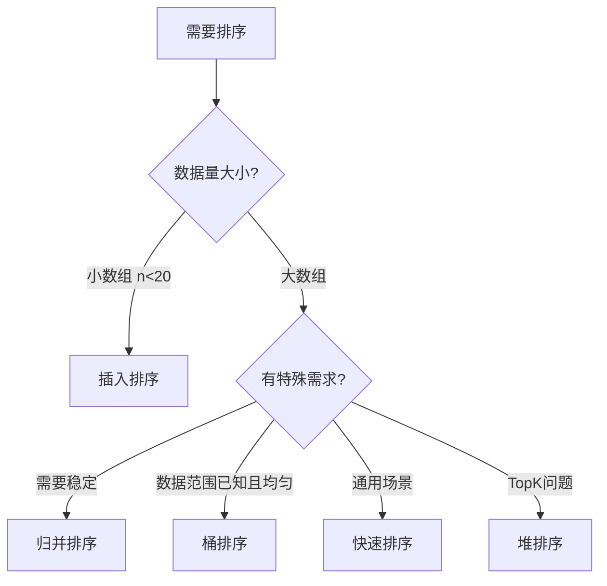
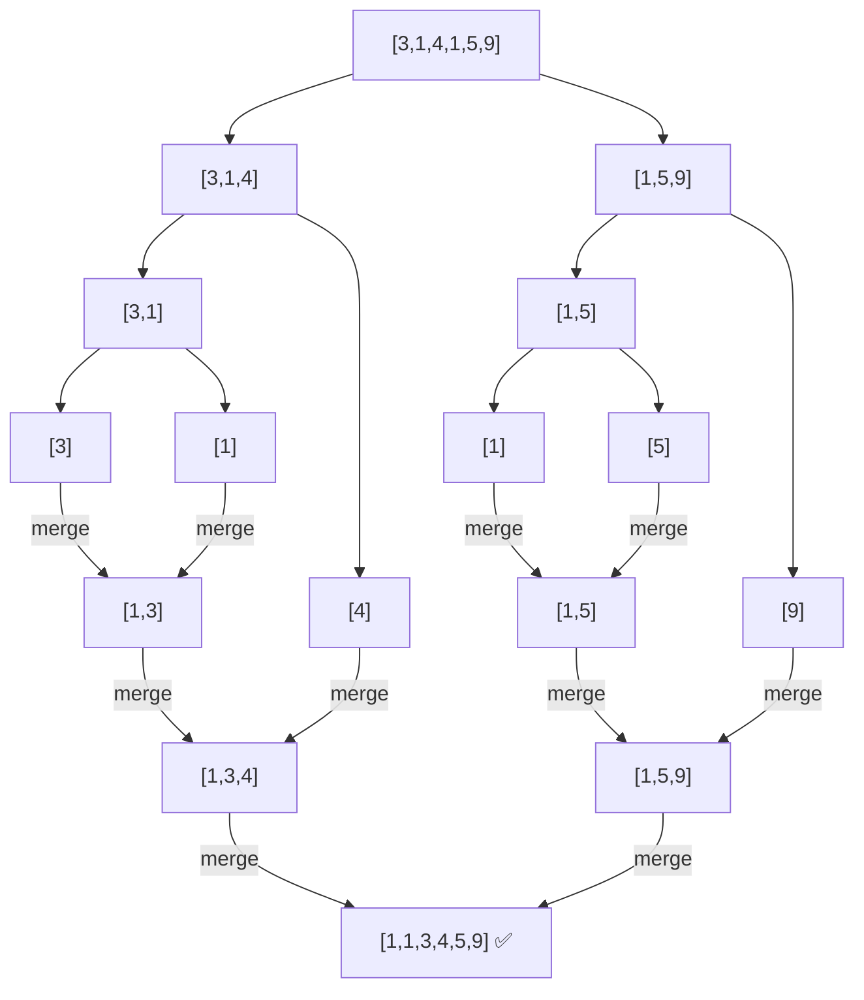
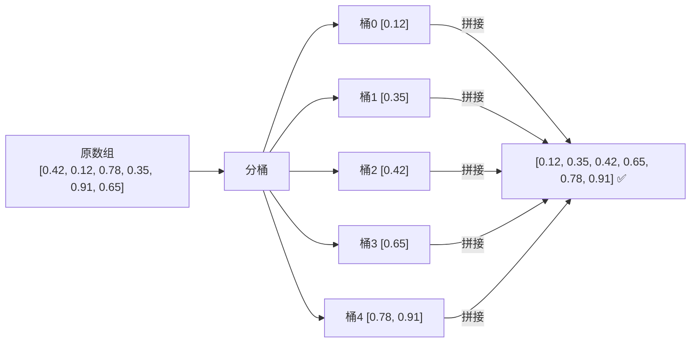

# 排序算法全览

> 前端面试高频考点，重点掌握：快速排序、归并排序，了解其余

---

## 一、各排序算法对比

| 算法 | 时间复杂度（平均） | 时间复杂度（最坏） | 空间复杂度 | 稳定性 | 适用场景 |
|------|-----------------|-----------------|-----------|--------|---------|
| 冒泡排序 | O(n²) | O(n²) | O(1) | ✅ 稳定 | 学习用，几乎不用 |
| 选择排序 | O(n²) | O(n²) | O(1) | ❌ 不稳定 | 学习用 |
| 插入排序 | O(n²) | O(n²) | O(1) | ✅ 稳定 | 小数组、近乎有序的数组 |
| 快速排序 | O(n log n) | O(n²) | O(log n) | ❌ 不稳定 | **通用首选**，大多数场景 |
| 归并排序 | O(n log n) | O(n log n) | O(n) | ✅ 稳定 | **需要稳定排序**，链表排序 |
| 桶排序 | O(n + k) | O(n²) | O(n + k) | ✅ 稳定 | 数据均匀分布，范围已知 |
| 堆排序 | O(n log n) | O(n log n) | O(1) | ❌ 不稳定 | TopK 问题 |

> **k** = 桶的数量 / 数据范围

---

## 二、排序算法流程图



---

## 三、各排序实现

### 1. 冒泡排序

**思路**：每轮把最大值"冒泡"到末尾，n 轮后有序。

```js
function bubbleSort(arr) {
  const n = arr.length
  for (let i = 0; i < n - 1; i++) {
    for (let j = 0; j < n - 1 - i; j++) {
      if (arr[j] > arr[j + 1]) {
        [arr[j], arr[j + 1]] = [arr[j + 1], arr[j]]
      }
    }
  }
  return arr
}
```

- 时间 O(n²)，空间 O(1)，稳定
- 优化：加 `swapped` 标志，若一轮无交换则提前退出 → 最好 O(n)

---

### 2. 选择排序

**思路**：每轮从未排序区找最小值，放到已排序区末尾。

```js
function selectionSort(arr) {
  const n = arr.length
  for (let i = 0; i < n - 1; i++) {
    let minIdx = i
    for (let j = i + 1; j < n; j++) {
      if (arr[j] < arr[minIdx]) minIdx = j
    }
    if (minIdx !== i) [arr[i], arr[minIdx]] = [arr[minIdx], arr[i]]
  }
  return arr
}
```

- 时间 O(n²)，空间 O(1)，**不稳定**（交换可能打乱相等元素顺序）

---

### 3. 插入排序

**思路**：把未排序元素插入已排序区的合适位置，像整理扑克牌。

```js
function insertionSort(arr) {
  for (let i = 1; i < arr.length; i++) {
    const current = arr[i]
    let j = i - 1
    while (j >= 0 && arr[j] > current) {
      arr[j + 1] = arr[j]
      j--
    }
    arr[j + 1] = current
  }
  return arr
}
```

- 时间 O(n²)，空间 O(1)，稳定
- **最好情况 O(n)**（数组已近乎有序）
- 实际应用：TimSort（JS/Python 内置排序）在小数组时用插入排序

---

### 4. 快速排序 ⭐

**思路**：选基准值 pivot，把数组分成"小于 pivot"和"大于 pivot"两部分，递归处理。

```js
function quickSort(arr) {
  if (arr.length <= 1) return arr
  
  const pivot = arr[Math.floor(arr.length / 2)]
  const left = arr.filter(x => x < pivot)
  const mid  = arr.filter(x => x === pivot)
  const right = arr.filter(x => x > pivot)
  
  return [...quickSort(left), ...mid, ...quickSort(right)]
}
```

**原地版（空间更优）：**

```js
function quickSortInPlace(arr, left = 0, right = arr.length - 1) {
  if (left >= right) return arr
  
  const pivotIdx = partition(arr, left, right)
  quickSortInPlace(arr, left, pivotIdx - 1)
  quickSortInPlace(arr, pivotIdx + 1, right)
  return arr
}

function partition(arr, left, right) {
  const pivot = arr[right]  // 选最右边为基准
  let i = left - 1
  for (let j = left; j < right; j++) {
    if (arr[j] <= pivot) {
      i++
      ;[arr[i], arr[j]] = [arr[j], arr[i]]
    }
  }
  ;[arr[i + 1], arr[right]] = [arr[right], arr[i + 1]]
  return i + 1
}
```

- 时间 O(n log n) 平均，O(n²) 最坏（已排序数组 + 选首/尾为基准）
- 空间 O(log n) 递归栈
- **不稳定**
- 优化：随机选 pivot、三数取中法 → 降低最坏情况概率

---

### 5. 归并排序 ⭐

**思路**：分治——把数组不断对半分，直到长度为 1，然后两两有序合并。



```js
function mergeSort(arr) {
  if (arr.length <= 1) return arr
  
  const mid = Math.floor(arr.length / 2)
  const left = mergeSort(arr.slice(0, mid))
  const right = mergeSort(arr.slice(mid))
  
  return merge(left, right)
}

function merge(left, right) {
  const result = []
  let i = 0, j = 0
  
  while (i < left.length && j < right.length) {
    if (left[i] <= right[j]) {
      result.push(left[i++])
    } else {
      result.push(right[j++])
    }
  }
  
  return [...result, ...left.slice(i), ...right.slice(j)]
}

// 测试
console.log(mergeSort([3, 1, 4, 1, 5, 9, 2, 6])) // [1,1,2,3,4,5,6,9]
```

- 时间 O(n log n)，**最坏也是 O(n log n)**（稳定！）
- 空间 O(n)（需要额外数组存 merge 结果）
- **稳定排序** ← 关键优势
- **链表排序首选**（[148] 排序链表就是用归并，因为链表不需要额外空间）

**和快速排序的核心区别：**

```
快速排序：先分区（partition），再递归 → 处理在分的过程
归并排序：先递归，再合并（merge） → 处理在合的过程
```

---

### 6. 桶排序

**思路**：把数据按范围分到若干个桶里，每个桶内部排序，再把桶拼起来。



```js
function bucketSort(arr, bucketSize = 5) {
  if (arr.length <= 1) return arr
  
  const min = Math.min(...arr)
  const max = Math.max(...arr)
  
  // 创建桶
  const bucketCount = Math.floor((max - min) / bucketSize) + 1
  const buckets = Array.from({ length: bucketCount }, () => [])
  
  // 分配元素到桶
  for (const val of arr) {
    const idx = Math.floor((val - min) / bucketSize)
    buckets[idx].push(val)
  }
  
  // 每个桶内排序，然后拼接
  return buckets.flatMap(bucket => bucket.sort((a, b) => a - b))
}

// 测试
console.log(bucketSort([29, 25, 3, 49, 9, 37, 21, 43])) // [3,9,21,25,29,37,43,49]
```

- 时间 O(n + k)，k 为桶数量；若分布均匀接近 O(n)
- 最坏 O(n²)（所有元素落在同一个桶里）
- 空间 O(n + k)
- **稳定**（桶内使用稳定排序时）

**适用场景：**
- 数据分布均匀、范围已知（如成绩 0-100、年龄 0-120）
- 数据量大但值域有限
- 外部排序（数据太大放不进内存时）

---

## 四、快速排序 vs 归并排序（面试重点）

| 对比项 | 快速排序 | 归并排序 |
|--------|---------|---------|
| 时间复杂度 | O(n log n) 平均，O(n²) 最坏 | **O(n log n) 稳定** |
| 空间复杂度 | **O(log n)**（递归栈） | O(n)（需要额外数组） |
| 稳定性 | ❌ 不稳定 | ✅ 稳定 |
| 适合数据结构 | 数组（随机访问） | **链表**（顺序访问） |
| 实际性能 | 通常更快（缓存友好） | 稳定但内存开销大 |
| 最坏情况触发 | 已排序 + 选首尾为 pivot | 不存在最坏 |

**选择口诀：**
- 不在乎稳定，用快排（更快更省空间）
- 需要稳定 / 排链表，用归并
- 数据范围确定且均匀，用桶排序

---

## 五、面试常问

**Q: 快速排序最坏情况是什么？怎么优化？**
> 最坏情况：数组已经有序，且每次选首/尾为 pivot，退化为 O(n²)。
> 优化：随机选 pivot，或三数取中法（取首、中、尾的中间值）。

**Q: 为什么归并排序适合链表？**
> 链表没有随机访问，不能用快排的 partition（需要频繁交换）。
> 归并只需要顺序遍历 + 调整指针，完全适合链表，且空间可以做到 O(1)。

**Q: JS 的 Array.sort() 用的什么算法？**
> TimSort = 插入排序（小数组）+ 归并排序（大数组）的混合算法，稳定，O(n log n)。

**Q: 桶排序的时间复杂度怎么算？**
> n 个元素分到 k 个桶，每桶平均 n/k 个，每桶排序 O(n/k · log(n/k))，共 k 桶。
> 当 k ≈ n 时，趋近 O(n)。

---

## 六、JS 原生 Array.sort() 深度解析

### 底层算法：TimSort

`Array.prototype.sort()` 在所有现代 JS 引擎（V8/SpiderMonkey/JavaScriptCore）中均使用 **TimSort**。

> TimSort = **插入排序**（小数组）+ **归并排序**（大数组）的混合算法
> 由 Tim Peters 于 2002 年为 Python 设计，后被 Java、Chrome V8 等广泛采用。

### 核心策略

```
数组长度 < 64（阈值 minRun）
    └─→ 直接用插入排序（小数组 cache 友好，常数项小）

数组长度 >= 64
    └─→ 识别已有序的连续子序列（run）
         ├─ 升序 run：直接保留
         └─ 严格降序 run：翻转变升序
        若 run 太短（< minRun）：用插入排序扩展到 minRun 长度
        最后用归并排序把所有 run 两两合并
```

### 复杂度

| 场景 | 时间复杂度 | 说明 |
|------|-----------|------|
| 最好 | **O(n)** | 数组已经有序（只有一个 run） |
| 平均 | **O(n log n)** | 标准情况 |
| 最坏 | **O(n log n)** | 不像快排会退化到 O(n²) |
| 空间 | **O(n)** | 归并需要额外缓冲区 |

> ⭐ 关键优势：对**近乎有序**的数据表现极好（接近 O(n)），这在实际业务中非常常见！

### 稳定性

**✅ 稳定排序**（ES2019 规范明确要求）

```js
const arr = [
  { name: 'Alice', age: 25 },
  { name: 'Bob',   age: 25 },
  { name: 'Carol', age: 20 },
]

arr.sort((a, b) => a.age - b.age)
// Carol(20) → Alice(25) → Bob(25)
// Alice 和 Bob 年龄相同，原始顺序保留 ✅
```

> ⚠️ 注意：ES2019 之前规范未强制要求稳定性，旧版 V8 对大数组（>10个元素）曾使用不稳定的快排。现在可以放心使用。

### 使用注意事项

```js
// ❌ 不传 compareFn：默认转字符串按 Unicode 排，数字会出错！
[10, 9, 2, 100].sort()         // [10, 100, 2, 9] ← 字典序
[10, 9, 2, 100].sort((a,b) => a - b)  // [2, 9, 10, 100] ✅

// ✅ 升序
arr.sort((a, b) => a - b)

// ✅ 降序
arr.sort((a, b) => b - a)

// ✅ 对象按字段排序
arr.sort((a, b) => a.age - b.age)

// ✅ 字符串排序
arr.sort((a, b) => a.name.localeCompare(b.name))
```

### 原地修改

```js
// ⚠️ sort() 会直接修改原数组！
const original = [3, 1, 2]
const sorted = original.sort((a, b) => a - b)
console.log(original === sorted) // true，是同一个引用！

// 需要保留原数组时，先拷贝：
const sorted2 = [...original].sort((a, b) => a - b)
```

### 简化版 TimSort 实现

> 真实 V8 源码有几千行，这里抓核心骨架，理解思想就够了。

```js
const MIN_RUN = 32  // 小数组阈值，真实实现是 32~64 之间动态计算

// 1. 插入排序（对 arr[left..right] 区间排序）
function insertionSort(arr, left, right, compare) {
  for (let i = left + 1; i <= right; i++) {
    const cur = arr[i]
    let j = i - 1
    while (j >= left && compare(arr[j], cur) > 0) {
      arr[j + 1] = arr[j]
      j--
    }
    arr[j + 1] = cur
  }
}

// 2. 合并两个有序区间 arr[left..mid] 和 arr[mid+1..right]
function merge(arr, left, mid, right, compare) {
  const leftArr = arr.slice(left, mid + 1)
  const rightArr = arr.slice(mid + 1, right + 1)
  let i = 0, j = 0, k = left

  while (i < leftArr.length && j < rightArr.length) {
    // 注意：相等时取左边 → 保证稳定性
    if (compare(leftArr[i], rightArr[j]) <= 0) {
      arr[k++] = leftArr[i++]
    } else {
      arr[k++] = rightArr[j++]
    }
  }
  while (i < leftArr.length) arr[k++] = leftArr[i++]
  while (j < rightArr.length) arr[k++] = rightArr[j++]
}

// 3. TimSort 主函数
function timSort(arr, compare = (a, b) => a - b) {
  const n = arr.length

  // 第一步：对每个 minRun 大小的分块用插入排序
  for (let left = 0; left < n; left += MIN_RUN) {
    const right = Math.min(left + MIN_RUN - 1, n - 1)
    insertionSort(arr, left, right, compare)
  }

  // 第二步：逐轮将相邻的有序块两两归并，块大小每轮翻倍
  for (let size = MIN_RUN; size < n; size *= 2) {
    for (let left = 0; left < n; left += size * 2) {
      const mid = Math.min(left + size - 1, n - 1)
      const right = Math.min(left + size * 2 - 1, n - 1)
      if (mid < right) {
        merge(arr, left, mid, right, compare)
      }
    }
  }

  return arr
}

// 测试
const arr = [5, 2, 8, 1, 9, 3, 7, 4, 6]
console.log(timSort(arr))  // [1,2,3,4,5,6,7,8,9]

// 对象排序（稳定性验证）
const people = [
  { name: 'Alice', age: 25 },
  { name: 'Bob',   age: 25 },
  { name: 'Carol', age: 20 },
]
timSort(people, (a, b) => a.age - b.age)
// Carol(20) → Alice(25) → Bob(25)，Alice/Bob 顺序保持 ✅
```

**核心要点总结：**

```
Phase 1：分块插入排序
  [5,2,8,1,9,3,7,4,6,...]
   └──── run ────┘└──── run ────┘  每块 32 个，用插入排序

Phase 2：归并合并（size 每轮 × 2）
  size=32:  [run0 + run1] [run2 + run3] ...
  size=64:  [run0+1 + run2+3] ...
  size=128: ...
  直到整个数组有序
```

> 真实 V8 还有"run 识别"（检测天然有序段）和"galloping 模式"（批量跳跃合并）等优化，但核心骨架就是这样。

### 面试回答模板

> **Q: JS 的 Array.sort() 用的什么算法？时间复杂度多少？**
>
> A: 使用 **TimSort**，是插入排序和归并排序的混合：
> - 小数组（< 64 个元素）用**插入排序**，cache 友好，常数项小
> - 大数组先识别已有序的 run，再用**归并排序**合并
> - 时间复杂度：最好 **O(n)**，平均和最坏都是 **O(n log n)**，不会退化
> - 空间复杂度 **O(n)**（归并需要缓冲区）
> - **稳定排序**（ES2019 规范保证）
> - 对近乎有序的数据有特别优化，接近 O(n)

---

## 七、相关 LeetCode 题目

| 题号 | 题目 | 关联算法 |
|------|------|---------|
| [148] | 排序链表 | 归并排序（链表版） |
| [912] | 排序数组 | 快速排序 / 归并排序 |
| [215] | 数组中的第 K 个最大元素 | 快速选择（partition 变体） |
| [347] | 前 K 个高频元素 | 桶排序思想 |
| [164] | 最大间距 | 桶排序 |
