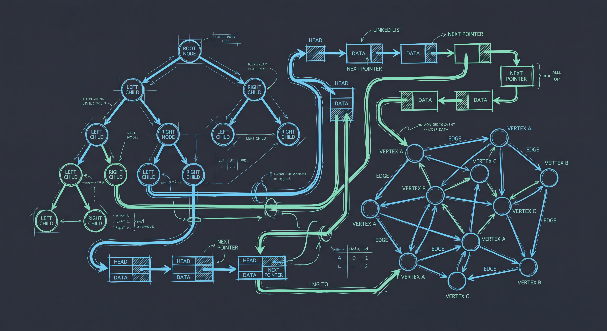

# 90-算法与数据结构 · 算法与数据结构

> 高频算法、数据结构、刷题计划。

## 学习定位

- **模块职责**：沉淀算法与数据结构相关的核心概念、实践经验和面试复习材料。
- **整理原则**：优先维护主干文档；课程笔记、旧题库和原始资料暂存，后续合并到主干。
- **索引约定**：本文是中文主索引；`README.md` 仅作为兼容入口。

## 主干文档

- [一个月周末算法巩固计划](./一个月周末算法巩固计划.md)
- [二叉树遍历与 BFS/DFS 专题](./二叉树遍历与BFS-DFS专题.md)
- [前端算法题型总结](./前端算法题型总结.md)
- [前端高频算法题精讲](./前端高频算法题精讲.md)
- [双指针与滑动窗口专题](./双指针与滑动窗口专题.md)
- [3个月算法维护计划（2026-03-28 ~ 2026-06-27）](./算法-3个月维护计划.md)
- [算法变体思路总结](./算法-变体题思路总结.md)
- [大厂变体题标准答案](./算法-大厂变体题标准答案.md)
- [大厂智力题合集](./算法-大厂智力题合集.md)
- [豆包对话提取 - 动态规划专题](./算法-豆包对话提取-DP专题.md)
- [豆包对话提取 - 算法与数据结构](./算法-豆包对话提取.md)
- [经典DP题精讲](./经典DP动态规划题精讲.md)
- [经典非DP题精讲](./经典非DP题精讲.md)
- [课程笔记-彩蛋 2 前端开发如何有针对性地学习算法？](./课程笔记-彩蛋 2 前端开发如何有针对性地学习算法？.md)

## 子目录

- [3周冲刺记录](./3周冲刺记录/README.md) — 39 篇笔记
- [动态规划](./动态规划/) — 0 篇笔记
- [字符串](./字符串/) — 0 篇笔记
- [搜索与回溯](./搜索与回溯/) — 0 篇笔记
- [数据结构](./数据结构/) — 0 篇笔记
- [数组](./数组/) — 1 篇笔记
- [链表](./链表/) — 0 篇笔记

## 整理记录

- 当前 Markdown 文档数：57
- 待合并、待删除和断链问题统一记录在 [知识库整理规划](../99-其他/知识库整理规划.md)。
