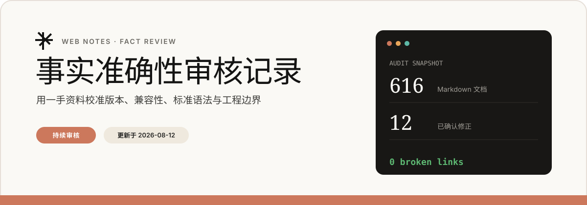

# 事实准确性审核记录

WEB NOTES · FACT REVIEW · UPDATED 2026-08-12

> [!IMPORTANT]
> 本文是知识库事实治理的唯一主记录。审核优先处理会导致代码无法运行、版本判断失效或面试表述明显错误的内容；未经官方资料确认的结论不会直接写回正文。

## 审核概览

| 指标 | 当前状态 |
| --- | ---: |
| Markdown 文档总数 | 616 |
| 本轮覆盖领域 | 4 类 |
| 已确认并修正 | 12 类问题 |
| 失效相对链接 | 0 |
| 失效导航双链 | 0 |
| 审核状态 | 持续进行中 |

### 审核流程

## 本轮覆盖范围

- CSS/HTML 2026 新特性、标准语法与浏览器支持状态。
- TypeScript 6.0/7.0 发布状态、配置方式与迁移边界。
- React 19.2 API 名称和使用语义。
- 会导致示例不可运行的废弃属性、错误配置和旧草案语法。

## 风险分级

| 级别 | 判定标准 | 处理策略 |
| --- | --- | --- |
| **P0 · 阻断** | 示例无法运行、配置值不存在、结论与当前正式版本冲突 | 立即修正正文 |
| **P1 · 时效** | 浏览器支持、版本状态或 API 名称已经过时 | 更新状态并注明日期 |
| **P2 · 边界** | 结论方向正确但表述绝对化、缺少适用条件 | 收敛措辞，补充边界 |
| **待核验** | 暂无足够一手资料或不同实现存在分歧 | 暂不修改，进入待办 |

## 已确认并修正

### P0 · 会直接误导实现

| 主题 | 原问题 | 修正结论 | 影响文档 |
| --- | --- | --- | --- |
| TypeScript 配置 | 使用不存在的 `module: "Bundler"` | 打包器项目改为 `module: "preserve"` + `moduleResolution: "bundler"` | [TypeScript 6.0 到 7.0](../03-TypeScript/TypeScript6-RC新特性.md) |
| Anchor Positioning | 示例继续使用旧属性 `inset-area` | 改为 `position-area`；旧名从 Chrome 129 起更名 | [CSS 新特性 2026 全图](../01-HTML-CSS/04-前沿特性与工程化/2024-2026新特性/CSS新特性-2026全图.md) |
| CSS Masonry | 混用 Safari 18 和旧草案 `grid-template-rows: masonry` | 更新为 Safari 26.4+ 的 `display: grid-lanes` | [CSS 现代布局特性 2026](../01-HTML-CSS/04-前沿特性与工程化/2024-2026新特性/CSS现代布局技术-2026.md) |

### P1 · 版本或兼容性已经过时

| 主题 | 原问题 | 修正结论 | 影响文档 |
| --- | --- | --- | --- |
| TypeScript 7 | 写成“预计 2026 年晚些发布” | 已于 2026-07-08 正式发布 | [TypeScript 6.0 到 7.0](../03-TypeScript/TypeScript6-RC新特性.md) |
| TypeScript 严格选项 | 把 `noUncheckedSideEffectImports`、`exactOptionalPropertyTypes` 写成 TS 6 新增 | 改为既有严格选项 | [TypeScript 6.0 到 7.0](../03-TypeScript/TypeScript6-RC新特性.md) |
| Anchor Positioning 支持 | 只写 Chrome，Safari 标记为“开发中” | 更新为 2026 年已进入 Baseline Newly Available | [CSS 现代布局特性 2026](../01-HTML-CSS/04-前沿特性与工程化/2024-2026新特性/CSS现代布局技术-2026.md) |
| `interestfor` | 错把 Popover API 的版本当作 `interestfor` 版本，并写成全浏览器支持 | 更新为 Chrome 142+、有限支持 | [CSS/HTML 交互新特性](../01-HTML-CSS/04-前沿特性与工程化/2024-2026新特性/CSS交互特性-hover与dialog-closedBy属性.md) |
| `dialog.closedBy` | 写成现代浏览器全支持 | 更新为 Limited availability，要求渐进增强 | [dialog closedBy 属性](../01-HTML-CSS/04-前沿特性与工程化/2024-2026新特性/dialog-closedBy属性笔记.md) |
| `lh` / `rlh` | Chrome 起始版本写成 119 | 修正为 Chrome 109+，标注 Baseline 2023 | [CSS 新特性 2026 全图](../01-HTML-CSS/04-前沿特性与工程化/2024-2026新特性/CSS新特性-2026全图.md) |
| `focusgroup` | 仍写成 Origin Trial | 更新为 Chrome 150 稳定能力；其他浏览器保留降级实现 | [focusgroup HTML 属性](../08-网络与浏览器/browser/CSS-focusgroup属性.md) |
| React Effect Event | 写成 `useEvent` / React 18 提案 | 更新为 React 19.2 的 `useEffectEvent` | [React 综合与重难点融合](../05-React/AI对话笔记-React综合与重难点融合.md) |

### P2 · 结论过度绝对化

| 主题 | 原问题 | 修正结论 | 影响文档 |
| --- | --- | --- | --- |
| Scroll-Driven Animations | 断言“完全在合成器线程，不触发主线程” | 改为条件性优化；是否进入合成阶段取决于动画属性和浏览器实现 | [CSS 新特性 2026 全图](../01-HTML-CSS/04-前沿特性与工程化/2024-2026新特性/CSS新特性-2026全图.md) |
| TypeScript 7 性能 | 写成所有项目固定提升 10 倍 | 改为官方完整构建基准通常约 8～12 倍，实际结果依工作负载而异 | [TypeScript 6.0 到 7.0](../03-TypeScript/TypeScript6-RC新特性.md) |

## 事实依据

> [!NOTE]
> 行业和技术结论优先采用规范、官方发布说明、官方兼容性文档。二手文章只用于发现线索，不单独作为修正依据。

### TypeScript

- [TypeScript 7.0 正式发布](https://devblogs.microsoft.com/typescript/announcing-typescript-7-0/)
- [TypeScript 6.0 发布说明](https://devblogs.microsoft.com/typescript/announcing-typescript-6-0/)

### Web 标准与浏览器

- [Chrome 129 Anchor Positioning 语法变更](https://developer.chrome.com/blog/anchor-syntax-changes)
- [MDN CSS Anchor Positioning](https://developer.mozilla.org/en-US/docs/Web/CSS/Guides/Anchor_positioning)
- [WebKit Safari 26.4 发布说明](https://webkit.org/blog/17862/webkit-features-for-safari-26-4/)
- [MDN Masonry / Grid Lanes](https://developer.mozilla.org/en-US/docs/Web/CSS/Guides/Grid_layout/Masonry_layout)
- [Chrome 142 Interest Invokers](https://developer.chrome.com/blog/new-in-chrome-142)
- [MDN HTMLDialogElement.closedBy](https://developer.mozilla.org/en-US/docs/Web/API/HTMLDialogElement/closedBy)
- [web.dev 2026 年 3 月 Web 平台更新](https://web.dev/blog/web-platform-03-2026)
- [web.dev 2026 年 6 月 Web 平台更新](https://web.dev/blog/web-platform-06-2026)

### React

- [React 19.2 发布说明](https://react.dev/blog/2025/10/01/react-19-2)

## 后续审核路线

- [ ] React Server Components、React Compiler、React 19.2 安全版本与框架集成边界。
- [ ] Node.js 新 API、运行时版本与 ESM/CommonJS 结论。
- [ ] MCP、A2A、AG-UI 的版本状态和官方定义。
- [ ] Core Web Vitals 阈值、DevTools 面板行为和线程模型。
- [ ] Event Loop、闭包、原型链和浏览器渲染中的过度简化结论。
- [ ] 面试题答案中的“永远”“一定”“完全”等高风险绝对化措辞。

## 审核约束

1. 每次审核只修改有充分证据支持的陈述。
2. 浏览器支持状态必须附带核验日期，避免把快照写成永久事实。
3. 版本性能数据必须注明基准范围，不把官方样例外推为所有项目结论。
4. 不因概念方向正确而保留无法运行的旧语法。
5. 每轮修正后运行链接巡检和 Git 差异检查。

---

> [!TIP]
> **✦ 持续维护原则**：具体笔记保留面向学习的正文，本文件集中维护审核证据、风险等级和修订历史。
